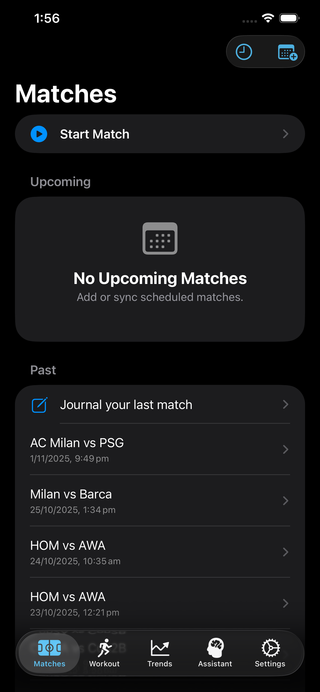
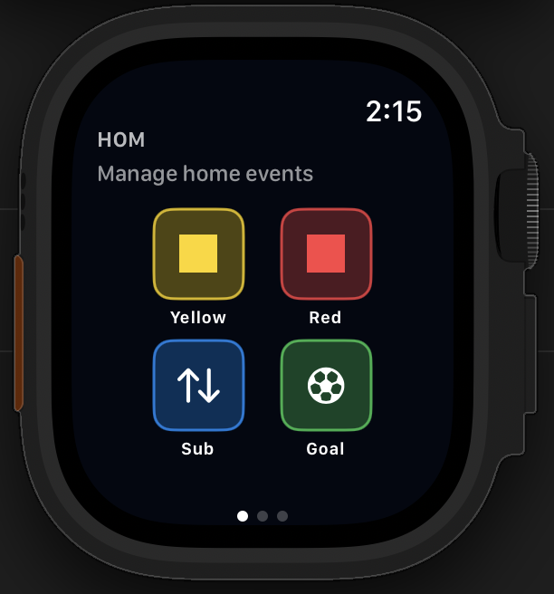

# RefWatch

[](LICENSE)
[](https://developer.apple.com/watchos/)
[](https://swift.org/)
[](https://developer.apple.com/xcode/)
[](https://supabase.com)
[](https://supabase.com/docs/guides/auth)
[](https://platform.openai.com/docs/api-reference/responses)
[](https://developers.google.com/identity/sign-in/ios)

<table align="center">
  <tr>
    <td></td>
    <td></td>
  </tr>
</table>

A watchOS-first app designed for football/soccer referees to manage matches efficiently. The Apple Watch app is production-ready for on-pitch use, while the companion iOS app provides match library management, live mirroring, and post-match review.

## Table of Contents

- [RefWatch](#refwatch)
  - [Table of Contents](#table-of-contents)
  - [Features](#features)
    - [Match Timer Management](#match-timer-management)
    - [Match Events Recording](#match-events-recording)
    - [Match Configuration](#match-configuration)
    - [Match Library (iOS)](#match-library-ios)
  - [Tech Stack](#tech-stack)
  - [Quick Start](#quick-start)
  - [Post-clone setup](#post-clone-setup)
    - [Prerequisites](#prerequisites)
    - [Setup](#setup)
  - [Architecture](#architecture)
  - [Documentation](#documentation)
  - [Contributing](#contributing)
  - [Security](#security)
  - [License](#license)

## Features

### Match Timer Management
- Start/pause/resume match timing with haptic feedback
- Automatic period tracking with configurable durations
- Half-time countdown
- Extra time and stoppage time support
- Penalty shootout mode

### Match Events Recording
- Goals (with goal type: open play, penalty, own goal)
- Yellow and red cards with reason tracking
- Substitutions
- Team-specific event attribution

### Match Configuration
- Customizable match duration (e.g., 45, 40, 35 min halves)
- Adjustable number of periods
- Half-time length settings
- Extra time and penalties options
- Save match templates for quick setup

### Match Library (iOS)
- Team management
- Competition/league organization
- Venue tracking
- Match history with full event logs

## Tech Stack

| Layer | Technology | Purpose |
|-------|-----------|---------|
| UI Framework | SwiftUI | Declarative UI for watchOS and iOS |
| Local Storage | SwiftData | On-device persistence |
| Cloud Database | [Supabase](https://supabase.com) (PostgreSQL) | Match sync, team library, user data |
| Authentication | Supabase Auth + [Google Sign-In SDK](https://github.com/google/GoogleSignIn-iOS) | Apple Sign-In, Google OAuth |
| AI Assistant | [OpenAI Responses API](https://platform.openai.com) | Match analysis and referee assistance |

The app works fully offline using SwiftData. When connected, data syncs to Supabase with automatic retry for failed uploads.

## Quick Start

## Post-clone setup

- Run `./scripts/setup.sh` to generate `RefWatchiOS/Config/Config.xcconfig` with your Team ID, bundle prefix, app group, and URL scheme (local-only, gitignored).
- Optional: copy `RefWatchiOS/Config/Secrets.example.xcconfig` to `RefWatchiOS/Config/Secrets.xcconfig` and add API keys.
- Optional: configure Google Sign-In credentials in `Secrets.xcconfig` (see setup step 5).

### Prerequisites

- **Xcode 15.4+** (Swift 5.9)
- **Apple Developer Account** (for device deployment)
- **watchOS 11.0+** target device or simulator
- **iOS 17.0+** for companion app (optional)

**Optional cloud services:**
- [Supabase](https://supabase.com/dashboard) — Cloud sync and authentication
- [OpenAI](https://platform.openai.com) — AI assistant (uses gpt-4o-mini)
- [Google Cloud Console](https://console.cloud.google.com) — OAuth client ID for Google Sign-In

### Setup

1. **Clone the repository**
   ```bash
   git clone https://github.com/yourusername/RefWatch.git
   cd RefWatch
   ```

2. **Run the setup script**
   ```bash
   chmod +x scripts/setup.sh
   ./scripts/setup.sh
   ```
   This will prompt you for:
   - Apple Development Team ID
   - Bundle identifier prefix
   - App Group identifier
   - URL scheme

   **Recommended:** Install git hooks to prevent committing secrets:
   ```bash
   ./scripts/install-git-hooks.sh
   ```

3. **Configure App Group entitlements**

   After running setup.sh, you must manually update the App Group in the entitlements files to match your App Group ID:

   - `RefWatch Watch App.entitlements`
   - `RefWatchWidgetsExtension.entitlements`

   Replace `group.refwatch.shared` with your App Group ID (e.g., `group.yourcompany.refwatch`).

   You'll also need to create the App Group in the Apple Developer portal:
   1. Go to [Identifiers](https://developer.apple.com/account/resources/identifiers)
   2. Click '+' and select 'App Groups'
   3. Enter your App Group ID

4. **Configure API keys** (required for cloud features)
   ```bash
   cp RefWatchiOS/Config/Secrets.example.xcconfig RefWatchiOS/Config/Secrets.xcconfig
   ```
   Edit `Secrets.xcconfig` with your API keys if using cloud features.

   **Environment Variables Reference:**

   | Variable | Service | Description |
   |----------|---------|-------------|
   | `SUPABASE_URL` | Supabase | Your project URL |
   | `SUPABASE_PUBLISHABLE_KEY` | Supabase | Public/anon key |
   | `OPENAI_API_KEY` | OpenAI | API key for assistant |
   | `GID_CLIENT_ID` | Google | OAuth client ID |
   | `GID_REVERSED_CLIENT_ID` | Google | Reversed client ID for URL scheme |

5. **Google Sign-In setup** (optional)
   - Create an OAuth 2.0 Client ID at [Google Cloud Console](https://console.cloud.google.com/apis/credentials)
   - Select "iOS" as the application type and enter your bundle identifier
   - Add the client ID to `GID_CLIENT_ID` in `Secrets.xcconfig`
   - Add the reversed client ID (e.g., `com.googleusercontent.apps.YOUR_ID`) to `GID_REVERSED_CLIENT_ID`

6. **Build and run**
   ```bash
   # Build watchOS app
   xcodebuild -project RefWatch.xcodeproj \
     -scheme "RefWatch Watch App" \
     -destination 'platform=watchOS Simulator,name=Apple Watch Series 9 (45mm)' \
     build

   # Build iOS companion app
   xcodebuild -project RefWatch.xcodeproj \
     -scheme "RefWatchiOS" \
     -destination 'platform=iOS Simulator,name=iPhone 15' \
     build
   ```

## Architecture

RefWatch follows a feature-first MVVM architecture with clear separation between platforms:

```
RefWatch/
├── RefWatchWatchOS/     # watchOS app (production-first)
│   ├── App/             # App entry point, navigation
│   ├── Core/            # Shared services, components
│   └── Features/        # Feature modules (Timer, Events, etc.)
├── RefWatchiOS/         # iOS companion app
│   ├── App/             # App entry, tabs, routing
│   ├── Core/            # Platform services, persistence
│   └── Features/        # Feature modules
├── RefWatchWidgets/     # watchOS complications
└── docs/                # Documentation
```

See [Architecture Overview](docs/architecture/overview.md) for detailed documentation.

## Documentation

- [Installation & Tooling](docs/getting-started/installation.md)
- [Running the App](docs/getting-started/running.md)
- [Architecture Overview](docs/architecture/overview.md)
- [Testing Strategy](docs/testing/strategy.md)
- [Contributing Guide](docs/process/contributing.md)

## Contributing

We welcome contributions! Please see our [Contributing Guide](docs/process/contributing.md) for details on:

- Branch naming conventions
- Development workflow
- Code review process
- Testing requirements

Before contributing, please read our [Code of Conduct](CODE_OF_CONDUCT.md).

## Security

For security vulnerabilities, please see our [Security Policy](SECURITY.md) for responsible disclosure guidelines.

## License

This project is licensed under the MIT License - see the [LICENSE](LICENSE) file for details.
