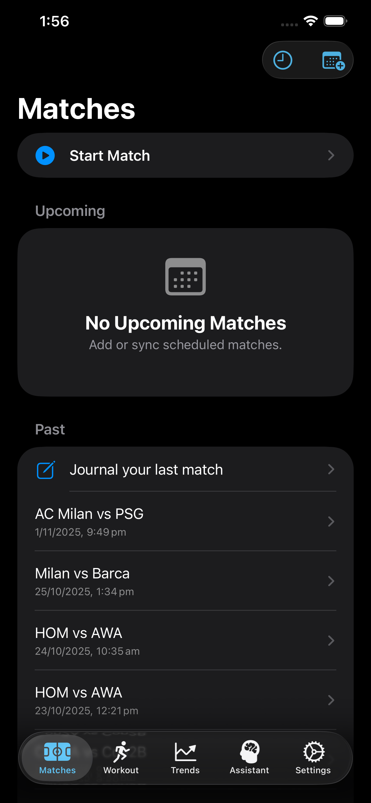
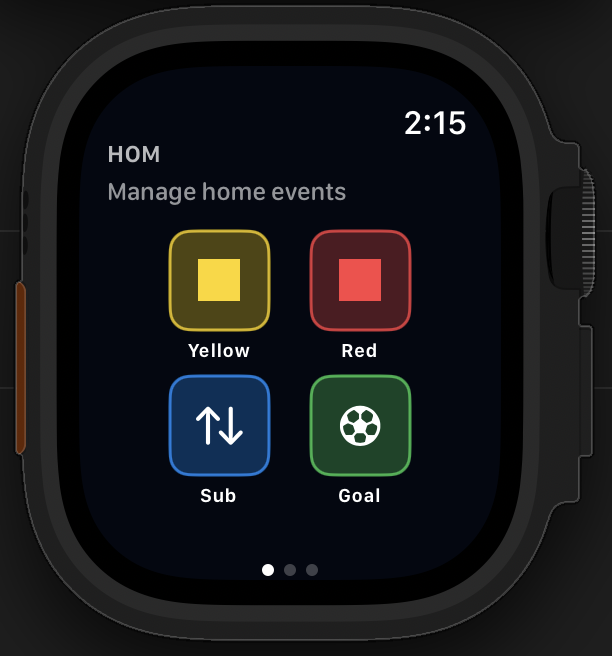

# RefWatch

[](LICENSE)
[](https://developer.apple.com/watchos/)
[](https://swift.org/)
[](https://developer.apple.com/xcode/)
[](https://developers.cloudflare.com/workers/)
[](https://clerk.com/docs)
[](https://planetscale.com/docs/postgres)
[](https://platform.openai.com/docs/api-reference/responses)

<table align="center">
  <tr>
    <td></td>
    <td></td>
  </tr>
</table>

A watchOS-first app designed for football/soccer referees to manage matches efficiently. The Apple Watch app is production-ready for on-pitch use, while the companion iOS app provides match library management, live mirroring, and post-match review.

## Table of Contents

- [RefWatch](#refwatch)
  - [Table of Contents](#table-of-contents)
  - [Features](#features)
    - [Match Timer Management](#match-timer-management)
    - [Match Events Recording](#match-events-recording)
    - [Match Configuration](#match-configuration)
    - [Match Library (iOS)](#match-library-ios)
  - [Tech Stack](#tech-stack)
  - [Quick Start](#quick-start)
  - [Post-clone setup](#post-clone-setup)
    - [Prerequisites](#prerequisites)
    - [Setup](#setup)
  - [Architecture](#architecture)
  - [Documentation](#documentation)
  - [Contributing](#contributing)
  - [Security](#security)
  - [License](#license)

## Features

### Match Timer Management
- Start/pause/resume match timing with haptic feedback
- Automatic period tracking with configurable durations
- Half-time countdown
- Extra time and stoppage time support
- Penalty shootout mode

### Match Events Recording
- Goals (with goal type: open play, penalty, own goal)
- Yellow and red cards with reason tracking
- Substitutions
- Team-specific event attribution

### Match Configuration
- Customizable match duration (e.g., 45, 40, 35 min halves)
- Adjustable number of periods
- Half-time length settings
- Extra time and penalties options
- Save match templates for quick setup

### Match Library (iOS)
- Team management
- Competition/league organization
- Venue tracking
- Match history with full event logs

## Tech Stack

| Layer | Technology | Purpose |
|-------|-----------|---------|
| UI Framework | SwiftUI | Declarative UI for watchOS and iOS |
| Local Storage | SwiftData | On-device persistence |
| Backend API | [Cloudflare Workers](https://developers.cloudflare.com/workers/) + Hono | Authenticated sync and server-side integrations |
| Cloud Database | [PlanetScale Postgres](https://planetscale.com/docs/postgres) via Hyperdrive | Match sync, team library, user data |
| Authentication | [Clerk](https://clerk.com/docs) | Native iOS sign-in and session tokens |
| AI Assistant | [OpenAI Responses API](https://platform.openai.com) | Match analysis and referee assistance |

The watch-first match runtime and local SwiftData stores remain offline-first. When cloud sync is enabled, iOS obtains a Clerk session token and calls the Worker with `Authorization: Bearer <clerk-session-token>`. Only the Worker can access PlanetScale or OpenAI.

> Migration status (2026-07-17): the active iOS composition builds and routes cloud-backed features, including reference-catalog reads, through Clerk and `BackendAPIClient`. The production foundation now has all 16 migrations, the exact 5/54 catalog seed, restricted roles, cache-disabled Hyperdrive, inactive ledger resources, and an unrouted Worker with writes/onboarding disabled and verified `refwatch.ibby.ai` Clerk pins. This is not a production cutover. Ledger-key recovery is blocked because the named Keychain record yields no recovered key bytes and the installed Worker secret is non-readable; source remediation, Secrets Store escrow, functional recovery, and production ledger activation/probe are separate gates. Remaining Clerk native/OAuth/webhook setup, final identity/data import and reconciliation, provider-routed authenticated coverage, physical-device acceptance, compatibility cleanup, traffic, and writes also remain separately gated. Legacy Supabase-named repositories/types may remain compiled until rollback and reconciliation gates permit cleanup; the Supabase SDK package is removed. See [Backend migration and cutover](docs/references/backend-migration-cutover.md).

## Quick Start

## Post-clone setup

- Run `./scripts/setup.sh` to generate `RefWatchiOS/Config/Config.xcconfig` with your Team ID, bundle prefix, app group, and URL scheme (local-only, gitignored).
- Production cloud configuration is approval-gated. Do not create or populate
  `RefWatchiOS/Config/Secrets.xcconfig` for the migration until the authoritative
  Apple identifiers, native registration, and configuration destination are
  reviewed and approved. Follow the cutover runbook rather than this quick start.

### Prerequisites

- **Xcode 16+** minimum for the iOS 18/watchOS 11 SDKs; the badge above records the newer repository-validated toolchain
- **Apple Developer Account** (for device deployment)
- **watchOS 11.0+** target device or simulator
- **iOS 17.0+** for companion app (optional)

**Cloud services for the target backend:**
- [Clerk](https://dashboard.clerk.com) — native authentication
- [Cloudflare Workers](https://dash.cloudflare.com) — Hono API and OpenAI proxy
- [PlanetScale Postgres](https://app.planetscale.com) — cloud persistence
- [OpenAI](https://platform.openai.com) — server-side assistant and match-sheet parsing

### Setup

1. **Clone the repository**
   ```bash
   git clone https://github.com/yourusername/RefWatch.git
   cd RefWatch
   ```

2. **Run the setup script**
   ```bash
   chmod +x scripts/setup.sh
   ./scripts/setup.sh
   ```
   This will prompt you for:
   - Apple Development Team ID
   - Bundle identifier prefix
   - App Group identifier
   - URL scheme

   **Recommended:** Install git hooks to prevent committing secrets:
   ```bash
   ./scripts/install-git-hooks.sh
   ```

3. **Configure App Group entitlements**

   After running setup.sh, you must manually update the App Group in the entitlements files to match your App Group ID:

   - `RefWatch Watch App.entitlements`
   - `RefWatchWidgetsExtension.entitlements`

   Replace `group.refwatch.shared` with your App Group ID (e.g., `group.yourcompany.refwatch`).

   You'll also need to create the App Group in the Apple Developer portal:
   1. Go to [Identifiers](https://developer.apple.com/account/resources/identifiers)
   2. Click '+' and select 'App Groups'
   3. Enter your App Group ID

4. **Configure local app-facing cloud values** (approval-gated)

   Do not execute this step for the production migration until the native and
   configuration lane is explicitly approved. After that approval, create the
   local/release file from the example as directed by the reviewed operator
   procedure:

   ```bash
   cp RefWatchiOS/Config/Secrets.example.xcconfig RefWatchiOS/Config/Secrets.xcconfig
   ```
   Add only the approved public app-facing values. Do not infer a Bundle ID,
   App ID Prefix, redirect URL, host, or key from this README.

   **Environment Variables Reference:**

   | Variable | Service | Description |
   |----------|---------|-------------|
   | `BACKEND_API_BASE_URL` | Cloudflare | Deployed Worker origin, with no trailing slash |
   | `CLERK_PUBLISHABLE_KEY` | Clerk | Public native-app key; safe to embed |
   | `CLERK_FRONTEND_API_HOST` | Clerk | Frontend API host used by the associated-domain capability |

   Never add `CLERK_SECRET_KEY`, `CLERK_JWT_KEY`, `CLERK_WEBHOOK_SIGNING_SECRET`, `DATABASE_URL`, PlanetScale credentials, or `OPENAI_API_KEY` to iOS configuration.

5. **Configure and run the Worker API**
   ```bash
   cd api
   npm install
   cp .dev.vars.example .dev.vars
   npm run typecheck
   npm test
   npm run dev
   ```
   The production foundation is already provisioned; do not recreate it or run
   a production deploy from this quick start. Remaining production secret,
   webhook, routing, and write steps require their exact approvals and the
   non-echoing procedures in the cutover runbook. Use `DATABASE_URL` only for
   local runtime fallback; use a separate migration-role `DATABASE_URL` with
   Drizzle tooling.

6. **Clerk native-app and webhook setup** (production approval-gated; do not
   execute from this quick start)

   - First obtain the authoritative Apple App ID Prefix, signed Bundle ID, and
     reviewed native redirect URL; do not infer them from project expressions.
   - Register the native app, configure production sign-in/OAuth methods, and
     install the approved public host/key only in the separately authorized
     native/OAuth phases.
   - Create the lifecycle webhook only after its exact reachable Worker endpoint,
     event allowlist, non-echoing secret path, and write-disabled probe are
     separately reviewed and approved. Follow
     `docs/references/backend-migration-cutover.md` for the staged procedure.

7. **Build and run**
   ```bash
   # Build watchOS app
   xcodebuild -project RefWatch.xcodeproj \
     -scheme "RefWatch Watch App" \
     -destination 'platform=watchOS Simulator,name=Apple Watch Series 9 (45mm)' \
     build

   # Build iOS companion app
   xcodebuild -project RefWatch.xcodeproj \
     -scheme "RefWatchiOS" \
     -destination 'platform=iOS Simulator,name=iPhone 15' \
     build
   ```

## Architecture

RefWatch follows a feature-first MVVM architecture with clear separation between platforms:

```
RefWatch/
├── api/                 # Cloudflare Worker/Hono API and Drizzle schema
├── RefWatchWatchOS/     # watchOS app (production-first)
│   ├── App/             # App entry point, navigation
│   ├── Core/            # Shared services, components
│   └── Features/        # Feature modules (Timer, Events, etc.)
├── RefWatchiOS/         # iOS companion app
│   ├── App/             # App entry, tabs, routing
│   ├── Core/            # Platform services, persistence
│   └── Features/        # Feature modules
├── RefWatchWidgets/     # watchOS complications
└── docs/                # Documentation
```

See [Architecture Overview](docs/design-docs/architecture/overview.md) for detailed documentation.

## Documentation

- [Installation & Tooling](docs/references/getting-started/installation.md)
- [Running the App](docs/references/getting-started/running.md)
- [Architecture Overview](docs/design-docs/architecture/overview.md)
- [Backend migration and cutover](docs/references/backend-migration-cutover.md)
- [Testing Strategy](docs/references/testing/strategy.md)
- [Contributing Guide](docs/references/process/contributing.md)

## Contributing

We welcome contributions! Please see our [Contributing Guide](docs/references/process/contributing.md) for details on:

- Branch naming conventions
- Development workflow
- Code review process
- Testing requirements

Before contributing, please read our [Code of Conduct](CODE_OF_CONDUCT.md).

## Security

For security architecture and the current migration risk register, see [docs/SECURITY.md](docs/SECURITY.md). For responsible disclosure, see [SECURITY.md](SECURITY.md).

## License

This project is licensed under the MIT License - see the [LICENSE](LICENSE) file for details.
